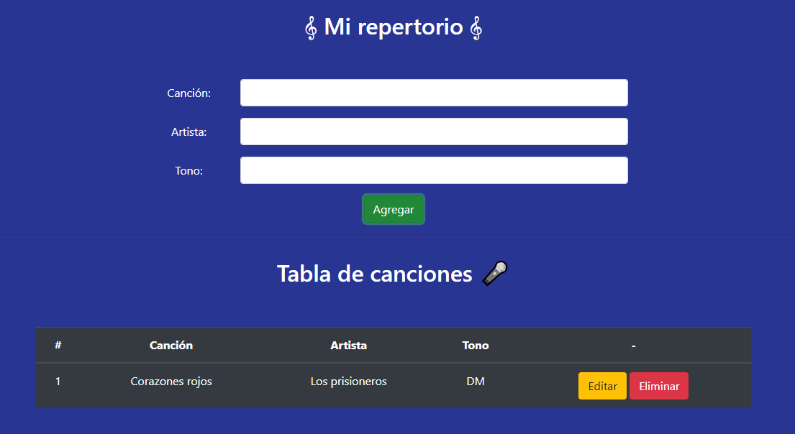

# Titulo del proyecto

Desafio Evaluado Mi Repertorio

## Descripción del proyecto

La escuela de música “E-Sueño” está motivando a sus estudiantes de canto a presentarse en
vivo y se puso en contacto con el restaurante del sector para usar su tarima e iniciar un
calendario de presentaciones. Para conocer y gestionar las canciones que cantarán sus
estudiantes, la escuela contrató a un desarrollador freelance para la creación de una
aplicación tipo CRUD.
En este desafío deberás desarrollar un servidor con Express que utilice el paquete pg para
conectarse con PostgreSQL y utilice funciones asíncronas para hacer las consultas a la base
de datos.

## Capturas de Pantalla del Proyecto

Incluir capturas de pantalla o imágenes que muestren el proyecto en funcionamiento.


Vista de crear cancion.

## Prerrequisitos o Dependencias

Lista de software y herramientas, incluyendo versiones, que necesitas para instalar y ejecutar este proyecto:

- Sistema Operativo (por ejemplo, Ubuntu 20.04, Windows 10)
- Lenguaje de programación (por ejemplo, Python 3.8)
- Framework (por ejemplo, Django 3.1)
- Base de datos (por ejemplo, PostgreSQL 12)
- Otros...

## Instalación del Proyecto

Una guía paso a paso sobre cómo configurar el entorno de desarrollo e instalar todas las dependencias.

```bash
# paso 1
```

Y así sucesivamente...

```bash
# paso 2
```

## Instrucciones para Ejecutar el Proyecto

Instrucciones para ejecutar el proyecto una vez instalado.

```bash
#
```

## Instrucciones para Cargar la Base de Datos o Migrar los Modelos

Instrucciones necesario para cargar la base de datos o migrar los modelos de datos.

```bash
#
```

## Instrucciones para Cargar los Datos Semilla a la Base de Datos

Comandos necesario para cargar los datos semilla a la base de datos.

```bash
# paso 1
```

Y así sucesivamente...

```bash
# paso 2
```

## Credenciales de Acceso

### Para Usuario Tipo Administrador

- Email: <administrador@mail.com>
- Contraseña: Abc123#

### Para Usuario Tipo User

- Email: <user@mail.com>
- Contraseña: Abc123#

Menciona a todos aquellos que ayudaron a levantar el proyecto desde sus inicios

- **Yanina Navarro** - *Trabajo Inicial* - [Yanina Navarro](https://github.com/yaninanavarro25)

## Licencia

Este proyecto está bajo la Licencia MIT - ve el archivo [LICENSE.md](LICENSE) para detalles

---

## Consejos Adicionales

Aquí hay algunos consejos extra para aprovechar al máximo tu README:

- Mantén cada sección lo más concisa posible. Evita la información innecesaria, ya que puede ser abrumadora para el lector.
- Asegúrate de que tus instrucciones de instalación, despliegue sean detalladas y precisas. Si hay pasos adicionales que el lector necesita tomar (como instalar dependencias extra), asegúrate de
incluirlos.
- Los visuales (imágenes, GIFs) son muy útiles para transmitir rápidamente lo que hace tu proyecto y cómo usarlo. Si puedes, incluye capturas de pantalla de tu aplicación en acción o GIFs que
demuestren su uso.

---

⌨️ con ❤️ por [Yanina Navarro](https://github.com/yaninanavarro25) 😊